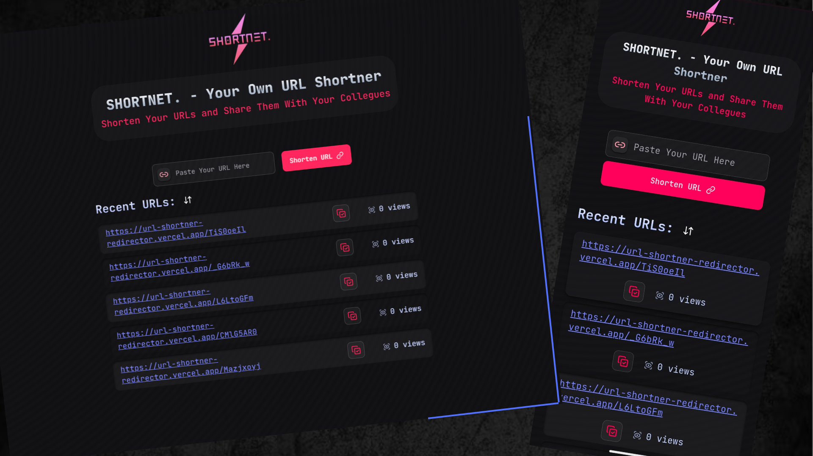

# 🔗 URL Shortener

A simple, minimal URL shortener built with **Next.js 15**, **Tailwind CSS**, **shadcn/ui**, **Lucide icons**, **Prisma**, and **PostgreSQL (hosted on Neon DB)**.

---

## 📸UI Preview


## ✨ Features

- 🔥 Built with the latest **Next.js 15 App Router**
- 🎨 Beautiful, responsive UI using **Tailwind CSS** and **shadcn/ui**
- 🧠 Shortens any valid URL and saves it to the database with a unique code
- ⚡ Displays shortened URLs instantly after submission
- 🚀 Redirects to the original URL when a shortened link is clicked
- 🛢️ Uses **Prisma ORM** for type-safe DB access with **PostgreSQL**

---

## 🛠️ Tech Stack

| Tool       | Usage                     |
|------------|---------------------------|
| Next.js 15 | React framework           |
| Tailwind   | Styling and layout        |
| shadcn/ui  | UI components             |
| Lucide     | Icons                     |
| Prisma     | ORM for database queries  |
| Neon       | PostgreSQL cloud DB       |

---

## 🧑‍💻 How It Works

1. **Paste URL:** User enters a long URL into the input form.
2. **Generate Code:** A short unique code is generated and saved in the database with the original URL.
3. **Show Result:** The shortened URL (based on your app’s base URL + short code) is shown to the user.
4. **Redirect:** When someone clicks the shortened URL:
   - The app extracts the `code` from the URL params.
   - It queries the database using `Prisma` to find the matching original URL.
   - Then, it **redirects** the user to the original site.

---

## 🧪 Getting Started (Dev)

```bash
# 1. Clone the repo
git clone https://github.com/KanadShee-18/URL-Shortner.git
cd URL-Shortner

# 2. Install dependencies
npm install

# Make sure to configure your .env file with your Neon DB connection string.
# .env
DATABASE_URL=postgresql://<username>:<password>@<host>/<db>?schema=public
NEXT_PUBLIC_BASE_URL=http://localhost:3000

# 3. Set up the database
npx prisma generate
npx prisma migrate dev

# 4. Run the dev server
npm run dev
```


## 📄 License

[LICENSE](LICENCE)


## ⭐ Support

If you found this project useful, consider giving it a ⭐️ to support the repository!

Feel free to fork it, suggest improvements, or open issues. Contributions are welcome!